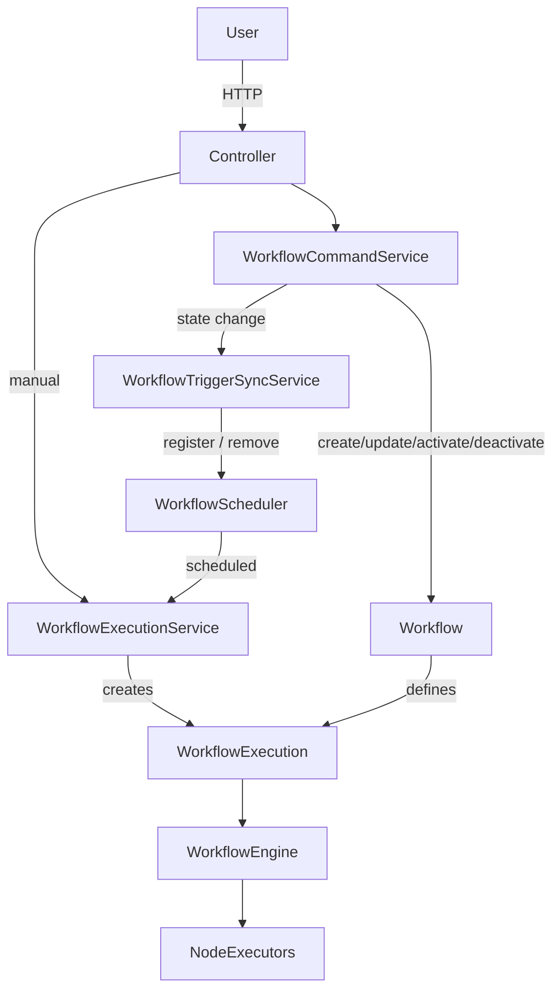

# Autofluo

> Workflow automation platform (early stage, redesign in progress)

Autofluo is a backend-focused side project where I explore the design and implementation of a workflow automation engine.

The project currently contains a **hardcoded workflow engine** used to validate core ideas.
A new execution architecture is being designed to support API integration, scheduling, and a clearer separation of responsibilities.

This README documents both the **current state** and the **intended redesign**, with explicit responsibility boundaries to avoid architectural drift during implementation.

This project is currently under active development.

---

## Current state

The current implementation includes:

* User creation and authentication endpoints
* A **hardcoded workflow engine** used as a first iteration
* Manual and scheduled triggers implemented directly in the engine
* Basic API integration

The current engine works, but mixes workflow definition, execution logic, trigger handling, and scheduling responsibilities.

---

## Target architecture (redesign)

The following architecture represents a **redesign of the execution layer**.
It is not fully implemented yet and serves as a guide for the next development phase.

One of the main lessons while integrating the engine with an API was that **execution logic needs its own lifecycle**, independent from workflow definition.

To address this, the system is designed around the following concepts:

* **Workflow**: purely descriptive. Defines nodes, connections, and triggers.
* **WorkflowExecution**: represents a single runtime execution of a workflow.
* **WorkflowEngine**: executes nodes for a given workflow execution.
* **Triggers**: declarative definitions that describe *when* executions should be created.
* **WorkflowScheduler**: schedules executions but does not execute workflows itself.

> The diagram below represents the target architecture and responsibility boundaries.

---

## Core domain concepts

### Workflow

* Describes nodes and their connections
* Defines available triggers (manual, scheduled, etc.)
* Has a lifecycle state (e.g. DRAFT, ACTIVE, INACTIVE)
* Has **no execution state**
* Does **not** execute anything by itself

The workflow is a **pure domain definition** and the source of truth for triggers.

---

### WorkflowExecution

* Represents a single execution of a workflow
* Owns execution state (e.g. pending, running, finished, failed)
* Holds execution context (inputs, metadata, runtime state)
* Is created by services, never by the workflow itself

> WorkflowExecution is introduced as a first-class domain concept in the redesign.
> Persistence and retries are planned but not implemented yet.

---

## Application services and responsibilities

### WorkflowCommandService

**Responsibility:** Apply domain commands to workflows.

* Create workflows
* Update workflow definitions
* Activate workflows
* Deactivate workflows
* Persist workflow state changes

This service:

* Does **not** execute workflows
* Does **not** register triggers directly
* Represents *user intent* and domain-level state changes

---

### WorkflowTriggerSyncService

**Responsibility:** Synchronize runtime triggers with workflow state.

* Reacts to workflow lifecycle changes (ACTIVE / INACTIVE)
* Reads workflow definitions from persistence
* Registers triggers in the `WorkflowScheduler` when a workflow becomes ACTIVE
* Removes triggers from the scheduler when a workflow becomes INACTIVE

This service:

* Is **not** a source of truth
* Does **not** own trigger definitions
* Exists to keep runtime infrastructure consistent with domain state

---

### WorkflowScheduler

**Responsibility:** Schedule executions based on registered triggers.

* Holds triggers only for ACTIVE workflows
* Creates scheduled execution events
* Delegates execution creation to `WorkflowExecutionService`

The scheduler:

* Does **not** store domain state
* Can be fully reconstructed from persisted workflows

---

### WorkflowExecutionService

**Responsibility:** Create workflow executions.

* Creates `WorkflowExecution` instances
* Is invoked by manual API triggers or the scheduler

---

### WorkflowEngine

**Responsibility:** Execute workflows.

* Executes nodes for a given `WorkflowExecution`
* Delegates node-specific logic to `NodeExecutors`

---

## Execution flow (high level)

1. A workflow is created or updated.
2. A workflow is activated or deactivated via a domain command.
3. Trigger synchronization reacts to the workflow state:

   * ACTIVE → triggers are registered in the scheduler
   * INACTIVE → triggers are removed from the scheduler
4. A manual or scheduled trigger creates a `WorkflowExecution`.
5. The `WorkflowEngine` executes nodes based on the execution context.
6. Execution state is updated independently of the workflow definition.

---

## Architectural decision (ADR – lifecycle-driven trigger registration)

**Decision:**
Trigger registration is a runtime concern derived from workflow lifecycle state, not a domain operation.

**Context:**
Workflows define triggers declaratively, but triggers should only exist in the scheduler while a workflow is ACTIVE.
The scheduler is not a source of truth and must be reconstructible from persisted state.

**Consequences:**

* Activating a workflow is a domain command
* Registering triggers is a side effect of activation
* Trigger synchronization is modeled as a separate responsibility
* Scheduler state is fully derivable

This separation keeps the domain model clean and allows future evolution (retries, async workers, observability) without coupling execution infrastructure to workflow definition.

---

## Not implemented yet (redesign)

The following items belong to the redesigned architecture and are not part of the current engine:

* Persistence of `WorkflowExecution`
* Retry mechanisms for failed executions
* Asynchronous execution with workers
* Execution cancellation / pause
* Observability (logs, metrics per execution)

These are intentionally left out for now to focus on a clean execution model.

---

## Roadmap

* Finalize new workflow engine implementation
* Introduce in-memory `WorkflowExecution` lifecycle
* Persist execution state
* Add retry support
* Improve API-triggered executions
* Add execution control (stop / pause)

---

## Why this project exists

This project is primarily a learning exercise focused on:

* backend architecture
* execution modeling
* separation of responsibilities
* designing systems that can evolve over time

It is **not** intended to be production-ready at this stage.

---

## Build in public

This project is being developed in public.
Architectural decisions and lessons learned are occasionally shared on LinkedIn as part of a *build in public* series.

---

## Disclaimer

This project currently contains a working, hardcoded engine.
The architecture described above represents a planned redesign and may evolve during implementation.