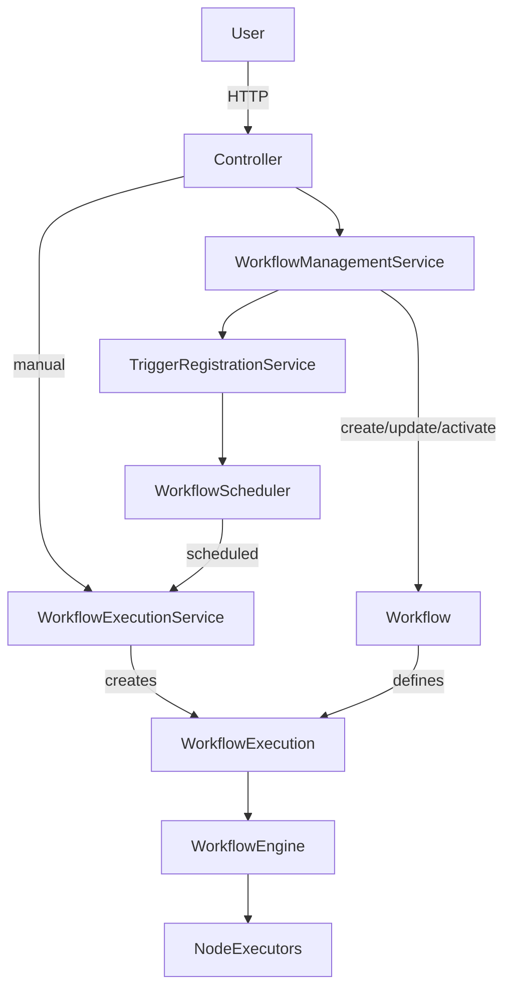

# Autofluo

> Workflow automation platform (early stage, redesign in progress)

Autofluo is a backend-focused side project where I explore the design and implementation of a workflow automation engine.

The project currently contains a **hardcoded workflow engine** used to validate core ideas.
A new execution architecture is being designed to support API integration, scheduling and better separation of concerns.

This README documents both the **current state** and the **intended redesign**.

This project is currently under active development.

## Current state

The current implementation includes:

- User creation and authentication endpoints
- A **hardcoded workflow engine** used as a first iteration
- Manual and scheduled triggers implemented directly in the engine
- Basic API integration

The current engine works, but mixes workflow definition, execution logic and scheduling responsibilities.

## Target architecture (redesign)

The following architecture represents a **redesign of the execution layer**.
It is not fully implemented yet and serves as a guide for the next development phase.

One of the main lessons while integrating the engine with an API was that **execution logic needs its own lifecycle**.

To address this, the system is designed around the following concepts:

* **Workflow**: purely descriptive. Defines nodes, connections, and triggers.
* **WorkflowExecution**: represents a single runtime execution of a workflow.
* **WorkflowEngine**: responsible for executing nodes based on a workflow execution.
* **Triggers**: declarative definitions that describe *when* executions should be created.
* **WorkFlowScheduler**: responsible only for scheduling executions, not running them.

> The diagram below represents the target architecture.

## Core domain concepts

### Workflow

* Describes nodes and their connections
* Defines available triggers (manual, scheduled, etc.)
* Has no execution state
* Does **not** execute anything by itself

### WorkflowExecution

* Represents a single execution of a workflow
* Owns execution state (e.g. pending, running, finished, failed)
* Holds execution context (inputs, metadata, runtime state)
* Created by services, not by the workflow itself

> WorkflowExecution is introduced as a first-class domain concept in the redesign.
> Persistence and retries are planned but not implemented yet.

## Execution flow (high level)

1. A workflow is created or updated.
2. Triggers are registered based on the workflow definition.
3. A manual or scheduled trigger creates a `WorkflowExecution`.
4. The `WorkflowEngine` executes nodes based on the execution context.
5. Execution state is updated independently of the workflow definition.

## Key design decisions
---
* **Separation of concerns**
  Workflow definition and execution are modeled as separate concepts.

* **Execution as a first-class entity**
  Execution state is explicit and isolated from the workflow definition.

* **Triggers are declarative**
  Triggers describe *when* to execute, not *how* to execute.

* **Scheduler as a messenger**
  The scheduler creates executions but does not run workflows itself.

## Not implemented yet (redesign)

The following items belong to the redesigned architecture and are not part of the current engine.

* Persistence of `WorkflowExecution`
* Retry mechanisms for failed executions
* Asynchronous execution with workers
* Execution cancellation / pause
* Observability (logs, metrics per execution)

These are intentionally left out for now to focus on a clean execution model.

## Roadmap

* Finalize new workflow engine implementation
* Introduce in-memory `WorkflowExecution` lifecycle
* Persist execution state
* Add retry support
* Improve API-triggered executions
* Add execution control (stop / pause)

## Why this project exists

This project is primarily a learning exercise focused on:

* backend architecture
* execution modeling
* separation of responsibilities
* designing systems that can evolve over time

It is **not** intended to be production-ready at this stage.

## Build in public

This project is being developed in public.
Architectural decisions and lessons learned are occasionally shared on LinkedIn as part of a *build in public* series.

## Disclaimer

This project currently contains a working, hardcoded engine.
The architecture described above represents a planned redesign and may evolve during implementation.